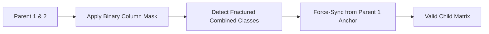
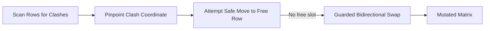
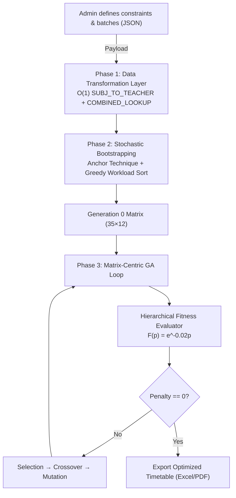

<div align="center">

# 🗓️ Automatic Class Scheduling using Matrix-Based Genetic Algorithm

**Zero-penalty academic timetabling — no manual conflict resolution required.**

[](https://hybridga.netlify.app/)
[](https://github.com/somnath503/ga-schedular/blob/main/Finalthesis_somnath.pdf)
[](https://github.com/somnath503/ga-schedular)
[](https://github.com/somnath503)

</div>

---

## 📌 Highlights

| -0d6efd?style=flat-square) |  |  |
|---|---|---|
|  |  | _Vectorized-20c997?style=flat-square) |

---

## ⚡ Problem & Solution

The **University Course Timetabling Problem (UCTP)** is NP-hard — the number of feasible schedule permutations grows exponentially with faculty, batches, rooms, and constraints. Traditional GA implementations flatten the schedule into 1D arrays and apply blind random mutation, which frequently destroys valid schedule blocks ("block destruction") and produces fragmented, unbalanced timetables.

**This project replaces blind randomness with domain-aware, coordinate-level repair:**

- Schedule is encoded as a **2D integer matrix** — `35 rows` (5 days × 7 periods) × `12 columns` (student batches) — enabling `O(1)` vectorized constraint lookups instead of flattening/reconstructing arrays every generation.
- A **Targeted Heuristic Mutation** operator diagnoses the *exact coordinates* of a clash (e.g., a double-booked teacher) and repairs it directly, instead of randomly perturbing genes.
- A **Column-Masking Crossover** with mandatory **Sync Repair** preserves intact weekly schedules and guarantees combined/multi-batch classes never desynchronize.
- The entire GA engine runs **client-side in the browser** — no scheduling backend required, fully installable as an offline-first PWA.

---

## 🛠 Tech Stack

| Layer | Technology |
|---|---|
| Core UI | React 19.2.6 |
| Build Tool | Vite 8.0.12 |
| Styling | Tailwind CSS 4.3.1 |
| State Management | Zustand 5.0.14 |
| Routing | React Router DOM 7.18.0 |
| Offline Support | Vite PWA 1.3.0 (Service Worker) |
| Data Export | SheetJS / XLSX 0.18.5 |
| Icons | Lucide React 1.21.0 |

> 🧪 The algorithm was originally prototyped and benchmarked in **Python 3.12 + NumPy + Pandas** (see [Experimental Results](#-experimental-results)), then ported to a fully vectorized **JavaScript GA engine** (`GeneticSchedulerJS`) for in-browser execution.

---

## 🧬 Algorithm Details

### 1. Matrix-Centric Representation

```
teacher_matrix = SUBJ_TO_TEACHER[schedule_matrix]   // O(1) lookup, no flattening
```

- `35 × 12` integer matrix — rows = time slots, columns = batches.
- Fixed `FREE_ROWS` reserve lunch/break periods.
- Entire rows (time slots across all batches) are evaluated via vectorized array ops instead of per-cell checks.

### 2. Column-Masking Crossover + Sync Repair

Standard single-point crossover cuts a chromosome mid-week, stitching unrelated days together ("block destruction"). Instead, a binary mask decides — per **entire batch column** — whether a child inherits Parent 1 or Parent 2's full 35-row schedule. Combined (multi-batch) classes that get fragmented by the mask are force-repaired against Parent 1 as the "chromatic anchor."



### 3. Targeted Heuristic Mutation

Rather than blind swaps, mutation actively scans for teacher clashes and resolves them hierarchically:



- **Safe Move** — migrate clashing subject to an empty, teacher-free row.
- **Guarded Swap** — swap with an occupied cell only if it introduces zero new clashes.
- Combined classes are treated as immutable anchors during mutation.

### 4. Hierarchical Constraint Assessment

Penalties are tiered across four orders of magnitude and compressed via an exponential fitness curve to avoid late-stage stagnation:

$$F(p) = e^{-0.02 \times p}$$

| Tier | Constraint | Penalty |
|---|---|---|
| Extreme Hard | Missing mandatory class | **10,000** / occurrence |
| Hard | Teacher double-booking | **5,000** / occurrence |
| Hard | Room capacity exceeded | 500 / occurrence |
| Hard | Combined class desynchronized | 500 / occurrence |
| Soft | Daily subject duplicate | 500 / occurrence |
| Hard | Lunch/free slot violation | 50 / occurrence |
| Soft | Teacher daily load exceeded `max(2, ⌈W/5⌉)` | 10 / excess session |

---

## 🔀 System Architecture



**Execution flow:** Data Structuring (once) → Intelligent Initialization → Fitness Evaluation → Crossover + Sync Repair → Targeted Mutation → Elitism → repeat until `penalty = 0`. In benchmark runs, convergence was reached between **Generation 85–135**, depending on workload density.

---

## 📊 Experimental Results

| Metric | Result |
|---|---|
| Convergence speed vs. random-mutation GA | **~42% faster** |
| Typical convergence (standard load, 140 sessions) | Generation ~85 |
| Dense workload (156 sessions) | Generation ~135 |
| Fitness eval time (2D tensor vs. flattened array) | ~10× faster |
| Population size / mutation rate | 100 / 0.2 |

> Full methodology, ablation study, and scalability analysis are documented in the [thesis paper](https://github.com/somnath503/ga-schedular/blob/main/Finalthesis_somnath.pdf) (Chapter 5).

---

## 📂 Project Structure

```
timetable/
├── dev-dist/          # PWA development distribution
├── dist/               # Production build output
├── public/             # Static assets
├── src/
│   ├── assets/         # UI images and icons
│   ├── components/     # Reusable UI components
│   ├── lib/             # Core Logic — GeneticSchedulerJS (GA engine)
│   ├── pages/           # React Router page views
│   ├── pwa/             # Service workers & PWA config
│   ├── App.jsx          # Root component
│   └── store.js         # Zustand state management
├── eslint.config.js     # Linter rules
└── vite.config.js       # Vite & Tailwind configuration
```

---

## 🚀 Getting Started

### Prerequisites
- Node.js v18+
- npm or yarn

### Installation

```bash
git clone https://github.com/somnath503/ga-schedular.git
cd ga-schedular
npm install
```

### Development

```bash
npm run dev
```
App runs at `http://localhost:5173`.

### Production Build & Preview

```bash
npm run build
npm run preview
```

Builds a PWA-ready bundle (service worker + offline caching) into `dist/`.

### Deployment

Currently deployed via **Netlify**:
🔗 **[hybridga.netlify.app](https://hybridga.netlify.app/)**

Any static host (Netlify, Vercel, GitHub Pages, Cloudflare Pages) works — deploy the contents of `dist/` after `npm run build`. No backend/server required since the GA engine runs entirely client-side.

---

## 🗺️ Roadmap / Future Scope

- **3D Spatial-Temporal Tensor** `S ∈ Z^(T×B×R)` — extend the matrix to natively include room allocation (`Time × Batch × Room`) instead of post-processing room assignment.
- Faculty preference weighting, lab/exam scheduling, multi-user cloud sync.
- Event-driven microservices backend (API Gateway → Event Bus → distributed GA workers) for enterprise-scale SaaS deployment.
- Generalized matrix-metaheuristic applications: crew scheduling (aviation), VRP (logistics), VM placement (cloud), EV fleet charging.

---


## 📚 Reference

This project is the implementation companion to the B.Tech dissertation:

> **Somnath Pandit**, *"Automatic Class Scheduling Using Constraint-Aware Genetic Algorithm"*, B.Tech Thesis, Dept. of Computer Science & Engineering, University of Kalyani, June 2026. Supervised by Mr. Jaydeep Paul.
> 📄 [Read the full thesis (PDF)](https://github.com/somnath503/ga-schedular/blob/main/Finalthesis_somnath.pdf)

---

<div align="center">

Built by [Somnath Pandit](https://github.com/somnath503) · Dept. of CSE, University of Kalyani

</div>
